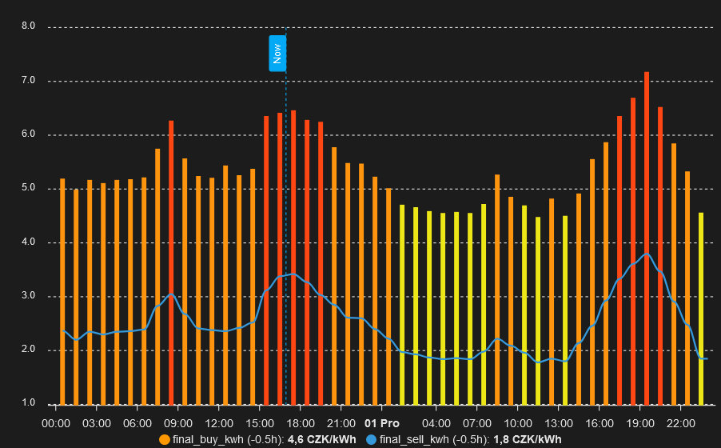

# EMHASS in Czech republic #
Zprovoznění EMHASS managmentu energie pro použití s českými spotovými cenami v Home assistantovi jako Add-onu. Jelikož je návod určen pro české prostředí, je použita čeština.

# Co je EMHASS? #
EMHASS - Energy managment system je predikční systém, který na základě vstupů (spotřeba domácnosti, výroba fotovoltaiky, nabití baterie, ceny spotu, ...) dokáže řídit efektivní nabíjení / vybíjení baterie, ovládání spotřebičů s odložitelým spuštěním a podobně. Zprovoznění není úplná banalita, ale za výsledek to stojí. Samotná optimalizace se spouští odpoledne v 13:35, jakmile jsou známy nové spotové ceny na další den. Boiler je použit jako odložitelná zátěž a jelikož ho nahřívám v noci, dopoledne a odpoledne, tak model ho zpracovává jako 3 samostatné zátěže s různými časovými okny a automatizace si to pospojuje (deferrable012). Systém umí nastavit své chování, jestli jde o cenu, efektivní spotřebu energie nebo prodej.

# Instalace #
1. V doplňcích nainstalovat EMHASS (https://github.com/davidusb-geek/emhass-add-on) - je potřeba přidat repozitář a zvolit EMHASS jako add-on.
2. V HACS přidat Nanogreen pro zjišťování spotových cen
3. V HACS přidat Solcast PV Forecast pro předpověď výrovy solárního sysému. Je třeba se zaregistrovat na stránky a dodat svoji elektrárnu (sklon, orientace, výkon, poloha). Do Home assistanta budeme pak potřebovat API-Key a Roof ID. Je dobré si pak předpovědi přidat do energy boardu, jsou hodně přesné.
4. V HACS přidat GoodWe experimental pro ovládání elektrárny. V případě jiného měniče je třeba upravit)
5. V zařízeních přidejte integraci FILE a přidejte službu zápisu oznámení do prvního souboru /share/data_load_cost_forecast.csv bez časového razítka a nastavte id_entity notify.file_load_cost_csv. Druhý soubor /share/data_prod_price_forecast.csv bez časového razítka a id_entity notify.file_sell_cost_csv. Tímto budeme EMHASSu předávat spotové ceny nákupu a prodeje.
6. Připojte se na filesystém Home assistanta a ve složce /share vytvořte soubor zero.csv , který obsahuje jednu mezeru.
# Konfikurace #
V Doplňcích / EMHASS / Nastavení nastavte dir /share, souřadnice long., lat. a alt,  solcast api, roof id a špičkový power elektrárny k kWp (s desetinnou čárkou)

Samotná konfigurace EMHASSu může vypadat následně (po přepnutí do textové formy):
```
{
  "battery_charge_efficiency": 0.9,
  "battery_charge_power_max": 7200,
  "battery_discharge_efficiency": 0.9,
  "battery_discharge_power_max": 8000,
  "battery_dynamic_max": 0.9,
  "battery_dynamic_min": -0.9,
  "battery_maximum_state_of_charge": 0.85,
  "battery_minimum_state_of_charge": 0.2,
  "battery_nominal_energy_capacity": 14200,
  "battery_target_state_of_charge": 0.4,
  "compute_curtailment": false,
  "continual_publish": false,
  "costfun": "profit",
  "delta_forecast_daily": 1,
  "end_timesteps_of_each_deferrable_load": [
    9,
    29,
    45
  ],
  "historic_days_to_retrieve": 7,
  "inverter_is_hybrid": true,
  "load_cost_forecast_method": "csv",
  "load_forecast_method": "naive",
  "load_negative": false,
  "load_offpeak_hours_cost": 0.1419,
  "load_peak_hour_periods": {
    "period_hp_1": [
      {
        "start": "02:54"
      },
      {
        "end": "15:24"
      }
    ],
    "period_hp_2": [
      {
        "start": "17:24"
      },
      {
        "end": "20:24"
      }
    ]
  },
  "load_peak_hours_cost": 0.1907,
  "logging_level": "INFO",
  "lp_solver": "default",
  "lp_solver_path": "empty",
  "maximum_power_from_grid": 12000,
  "maximum_power_to_grid": 6400,
  "method_ts_round": "first",
  "modules_per_string": [
    16
  ],
  "nominal_power_of_deferrable_loads": [
    2000,
    2000,
    2000
  ],
  "number_of_deferrable_loads": 3,
  "operating_hours_of_each_deferrable_load": [
    1.5,
    2,
    1.5
  ],
  "optimization_time_step": 30,
  "photovoltaic_production_sell_price": 1,
  "production_price_forecast_method": "csv",
  "pv_inverter_model": [
    "Fronius_International_GmbH__Fronius_Primo_5_0_1_208_240__240V_"
  ],
  "pv_module_model": [
    "CSUN_Eurasia_Energy_Systems_Industry_and_Trade_CSUN295_60M"
  ],
  "sensor_linear_interp": [
    "sensor.pv_power",
    "sensor.home_load_no_var_loads"
  ],
  "sensor_power_load_no_var_loads": "sensor.home_load_no_var_loads",
  "sensor_power_photovoltaics": "sensor.pv_power",
  "sensor_replace_zero": [
    "sensor.pv_power"
  ],
  "set_battery_dynamic": false,
  "set_deferrable_load_single_constant": [
    false,
    false,
    false
  ],
  "set_deferrable_startup_penalty": [
    0,
    0,
    0
  ],
  "set_nocharge_from_grid": false,
  "set_nodischarge_to_grid": false,
  "set_total_pv_sell": false,
  "set_use_battery": true,
  "set_zero_min": true,
  "start_timesteps_of_each_deferrable_load": [
    0,
    17,
    37
  ],
  "strings_per_inverter": [
    1
  ],
  "surface_azimuth": [
    180
  ],
  "surface_tilt": [
    25
  ],
  "treat_deferrable_load_as_semi_cont": [
    false,
    false,
    false
  ],
  "weather_forecast_method": "solar.forecast",
  "weight_battery_charge": 1.5,
  "weight_battery_discharge": 1
}
```

Do config.yaml přidat nastavení a senzory.
```
homeassistant:
  customize: !include customize.yaml
  allowlist_external_dirs:
    - /share
  
shell_command:
  restart_csv: cp /share/zero.csv /share/data_load_cost_forecast.csv; cp /share/zero.csv /share/data_prod_price_forecast.csv
  dayahead_optim: "curl -i -H \"Content-Type:application/json\" -X POST -d '{}' http://localhost:5000/action/dayahead-optim"
  publish_data: "curl -i -H \"Content-Type:application/json\" -X POST -d '{}' http://localhost:5000/action/publish-data"

binary_sensor:
  - platform: template
    sensors:
      deferrable012:
        value_template: "{{ states('sensor.p_deferrable0') | float(default=0) > 100 or states('sensor.p_deferrable1') | float(default=0) > 100 or states('sensor.p_deferrable2') | float(default=0) > 100}}" 

sensor:
  - platform: template
    sensors:
      final_buy_kwh:
        unit_of_measurement: 'CZK/kWh'
        device_class: monetary
        value_template: >-
          
            {{ (states('sensor.current_market_price_czk_kwh') | float(default=8.0)) * 1.21 + 2.22 }}
          
            {{ (states('sensor.current_market_price_czk_kwh') | float(default=8.0)) * 1.21 + 1.965 }}
          
        attribute_templates:
          hourly_prices: >-
            
            
            
              
                
              
                
              
              
            
            {{ ns.final }}

      final_sell_kwh:
        unit_of_measurement: 'CZK/kWh'
        device_class: monetary
        value_template: >-
          {{ (states('sensor.current_market_price_czk_kwh') | float(default=8.0)) - 0.3 }}
        attribute_templates:
          hourly_prices: >-
            
            
            
              
            
            {{ ns.final }}

      emhass_battery_control:
        unique_id: emhass_battery_control
        value_template: >-
            
            {{ 'charge' }}
          
            {{ 'discharge' }}
          
            {{ 'idle' }}
           
            {{ 'normal' }}                          
          

      p_deferrable012:
        value_template: "{{ states('sensor.p_deferrable0') | float(default=0) + states('sensor.p_deferrable1') | float(default=0) + states('sensor.p_deferrable2') | float(default=0)}}" 

      home_load_no_var_loads:
        unit_of_measurement: 'W'
        device_class: power
        value_template: "{{ states('sensor.load') | int + (states('sensor.back_up_load') | int) - (states('sensor.zasuvka_boiler_napajeni') | int) }}"

```
Poslední senzor je spotřeba domu bez odložitelných zátěží - zde boileru.

Součástí senzorů je i výpočet koncové ceny (final buy_kwh a energie final_sell_kwh) pro nákup a prodej. Je potřeba si ji upravit podle vašeho dodavatele / odběratele.

Dejte restartovat HA pro načtení config.yaml

# Provozní automatizace #
Nejprve automatizace pro předpověď výroby FVE pomocí Solcast (není nutné, ale budete mít v systému přesná aktuální předpovědní data):
```
alias: Solcast update
description: ""
triggers:
  - at: "23:58:00"
    trigger: time
  - at: "2:58:00"
    trigger: time
  - at: "6:58:00"
    trigger: time
  - at: "8:58:00"
    trigger: time
  - at: "10:58:00"
    trigger: time
  - at: "13:58:00"
    trigger: time
  - at: "16:58:00"
    trigger: time
conditions: []
actions:
  - data: {}
    action: solcast_solar.update_forecasts
mode: single
```
Generování csv souborů s hodinovými cenami a spuštění optimalizace
```
alias: EMHASS optimalizace
description: ""
triggers:
  - at: "13:32:00"
    trigger: time
actions:
  - action: shell_command.restart_csv
    data: {}
  - variables:
      prices: "{{ state_attr('sensor.final_buy_kwh', 'hourly_prices') }}"
      start_time: "{{ now().replace(minute=0, second=0) }}"
  - repeat:
      count: 24
      sequence:
        - data:
            message: >-
              {{ (as_datetime(start_time) + (repeat.index-1) *
              timedelta(minutes=60)).strftime('%Y-%m-%d %H:%M:%S') }},  {{
              prices[repeat.index+now().hour-1] | round(2) }}
          action: notify.send_message
          target:
            entity_id: notify.file_load_cost_csv
        - data:
            message: >-
              {{ (as_datetime(start_time) + (repeat.index-1) *
              timedelta(minutes=60) + timedelta(minutes=30)).strftime('%Y-%m-%d
              %H:%M:%S') }},  {{ prices[repeat.index+now().hour-1] | round(2) }}
          action: notify.send_message
          target:
            entity_id: notify.file_load_cost_csv
  - variables:
      prices: "{{ state_attr('sensor.final_sell_kwh', 'hourly_prices') }}"
      start_time: "{{ now().replace(minute=0, second=0) }}"
  - repeat:
      count: 24
      sequence:
        - data:
            message: >-
              {{ (as_datetime(start_time) + (repeat.index-1) *
              timedelta(minutes=60)).strftime('%Y-%m-%d %H:%M:%S') }},  {{
              prices[repeat.index+now().hour-1] | round(2) }}
          action: notify.send_message
          target:
            entity_id: notify.file_sell_cost_csv
        - data:
            message: >-
              {{ (as_datetime(start_time) + (repeat.index-1) *
              timedelta(minutes=60) + timedelta(minutes=30)).strftime('%Y-%m-%d
              %H:%M:%S') }},  {{ prices[repeat.index+now().hour-1] | round(2) }}
          action: notify.send_message
          target:
            entity_id: notify.file_sell_cost_csv
  - action: shell_command.dayahead_optim
    data: {}
```
Publikování aktuálních predikčních dat
```
alias: EMHASS publish
description: ""
trigger:
  - minutes: /5
    platform: time_pattern
    seconds: "0"
condition: []
action:
  - action: shell_command.publish_data
    data: {}
mode: single
```

# testování beta provozu #
Nyní je systém připraven, ale zatím nemá vliv na elektrárnu a spotřebiče. Po prvním spuštění optimalizace (v odpoledních hodinách, aby systém znal 24h cen dopředu) a publikování lze predikční data lze prohlížet v EMHASSu.

# Výkonná automatizace #
Všechno pracuje a je načase i konat.

Automatizace na řízení baterie:
```
alias: EMHASS battery control
description: >-
  používání baterie dle EMHASS, chybi dodělat discharge a zakázání přetoku při
  malých cenách
triggers:
  - trigger: state
    entity_id:
      - sensor.emhass_battery_control
  - trigger: state
    entity_id:
      - sensor.battery_state_of_charge
  - trigger: state
    entity_id:
      - sensor.soc_batt_forecast
conditions: []
actions:
  - if:
      - condition: or
        conditions:
          - condition: state
            entity_id: sensor.emhass_battery_control
            state: charge
          - condition: state
            entity_id: sensor.emhass_battery_control
            state: idle
    then:
      - alias: zakázání využívání baterie v charge a idle
        if:
          - alias: hloubka vybití baterie je pod 95%
            condition: numeric_state
            entity_id: number.goodwe_maximum_vybiti_v_siti
            above: 5
        then:
          - action: number.set_value
            metadata: {}
            data:
              value: 5
            target:
              entity_id: number.goodwe_maximum_vybiti_v_siti
            alias: vypnout používání baterie
    else:
      - alias: povolení využívání baterie v normal a discharge
        if:
          - alias: hloubka vybití baterie je pod 95%
            condition: numeric_state
            entity_id: number.goodwe_maximum_vybiti_v_siti
            below: 80
        then:
          - action: number.set_value
            metadata: {}
            data:
              value: 80
            target:
              entity_id: number.goodwe_maximum_vybiti_v_siti
            alias: vypnout používání baterie
  - if:
      - condition: state
        entity_id: sensor.emhass_battery_control
        state: charge
      - condition: numeric_state
        entity_id: sensor.battery_state_of_charge
        below: sensor.soc_batt_forecast
    then:
      - alias: nabijeni baterie
        if:
          - alias: měnič je v obecném reřimu
            condition: state
            entity_id: select.goodwe_provozni_rezim_stridace
            state: general
        then:
          - action: select.select_option
            metadata: {}
            data:
              option: eco_charge
            target:
              entity_id: select.goodwe_provozni_rezim_stridace
            alias: měnič zapne nabíjení baterie
    else:
      - alias: vypnuti nabijeni baterie
        if:
          - alias: měnič dobíjí baterii
            condition: state
            entity_id: select.goodwe_provozni_rezim_stridace
            state: eco_charge
        then:
          - action: select.select_option
            metadata: {}
            data:
              option: general
            target:
              entity_id: select.goodwe_provozni_rezim_stridace
            alias: měnič do obecného režimu
mode: single
```

Automatizace pro ovládání boileru:
```
alias: EMHASS boiler
description: ohřev boileru podle EMHASS 3x denně
triggers:
  - trigger: state
    entity_id:
      - sensor.p_deferrable0
  - trigger: state
    entity_id:
      - sensor.p_deferrable1
  - trigger: state
    entity_id:
      - sensor.p_deferrable2
conditions: []
actions:
  - if:
      - condition: or
        conditions:
          - condition:
              - condition: numeric_state
                entity_id: sensor.p_deferrable0
                above: 100
              - condition: numeric_state
                entity_id: sensor.p_deferrable1
                above: 100
              - condition: numeric_state
                entity_id: sensor.p_deferrable2
                above: 100
    then:
      - entity_id: switch.zasuvka_boiler_vypinac
        action: homeassistant.turn_on
    else:
      - entity_id: switch.zasuvka_boiler_vypinac
        action: homeassistant.turn_off
mode: single
```

Příklad mojí automatizace pro ovládání boileru s teplotními čidly a přetoky do nahřívání boileru:
```
alias: EMHASS Boiler s čidly teploty a FVE přebytky
description: inteligentní dohřívání boileru a počítání spotřeby boileru z FVE a ze sítě
triggers:
  - enabled: true
    seconds: "5"
    trigger: time_pattern
conditions: []
actions:
  - choose:
      - conditions:
          - condition: state
            entity_id: binary_sensor.deferrable012
            state: "off"
        sequence:
          - entity_id: switch.zasuvka_boiler_vypinac
            action: homeassistant.turn_off
      - conditions:
          - condition: or
            conditions:
              - condition: and
                conditions:
                  - condition: numeric_state
                    entity_id: sensor.teplota_boileru
                    below: 42
                  - condition: state
                    entity_id: binary_sensor.kapacita_pro_boiler
                    state: "on"
              - condition: and
                conditions:
                  - condition: state
                    entity_id: binary_sensor.vlazny_boiler
                    state: "on"
                  - condition: state
                    entity_id: binary_sensor.deferrable012
                    state: "on"
                  - condition: state
                    entity_id: binary_sensor.kapacita_pro_boiler
                    state: "on"
              - condition: and
                conditions:
                  - condition: state
                    entity_id: binary_sensor.kapacita_pro_boiler
                    state: "on"
                  - condition: numeric_state
                    entity_id: sensor.pv_power
                    above: 4000
                  - condition: numeric_state
                    entity_id: sensor.battery_state_of_charge
                    above: 75
              - condition: and
                conditions:
                  - condition: state
                    entity_id: binary_sensor.kapacita_pro_boiler
                    state: "on"
                  - condition: numeric_state
                    entity_id: sensor.pv_power
                    above: 2600
                  - condition: numeric_state
                    entity_id: sensor.battery_state_of_charge
                    above: 90
        sequence:
          - entity_id: switch.zasuvka_boiler_vypinac
            action: homeassistant.turn_on
    default:
      - entity_id: switch.zasuvka_boiler_vypinac
        action: homeassistant.turn_off
mode: single
```

# Příklady vizualizace #


)
```
square: false
type: grid
columns: 2
cards:
  - type: entities
    entities:
      - entity: sensor.p_deferrable012
      - entity: sensor.home_load_no_var_loads
      - entity: sensor.p_grid_forecast
      - entity: sensor.p_load_forecast
      - entity: sensor.p_pv_forecast
      - entity: sensor.p_batt_forecast
      - entity: sensor.soc_batt_forecast
      - entity: sensor.unit_load_cost
      - entity: sensor.unit_prod_price
    show_header_toggle: false
    state_color: true
  - type: custom:apexcharts-card
    span:
      start: minute
    header:
      show: true
      title: EMHASS Denní predikce
      show_states: true
      colorize_states: true
    now:
      show: false
      label: now
    yaxis:
      - id: power
        min: -1000
        max: 10000
        decimals: 2
        apex_config:
          forceNiceScale: true
          tick_amount: 4
    series:
      - entity: sensor.p_pv_forecast
        yaxis_id: power
        curve: stepline
        stroke_width: 3
        color: yellow
        show:
          in_header: false
          legend_value: false
        data_generator: |
          return entity.attributes.forecasts.map((entry) => {
            return [new Date(entry.date), entry.p_pv_forecast];
          });
      - entity: sensor.p_load_forecast
        yaxis_id: power
        curve: stepline
        type: line
        color: rgb(84, 144, 194)
        show:
          in_header: false
          legend_value: false
        stroke_width: 3
        data_generator: |
          return entity.attributes.forecasts.map((entry) => {
            return [new Date(entry.date), entry.p_load_forecast];
          });
      - entity: sensor.p_batt_forecast
        yaxis_id: power
        curve: stepline
        color: pink
        show:
          in_header: false
          legend_value: false
        stroke_width: 1
        type: area
        data_generator: |
          return entity.attributes.battery_scheduled_power.map((entry) => {
            return [new Date(entry.date), entry.p_batt_forecast];
          });
      - entity: sensor.p_grid_forecast
        yaxis_id: power
        curve: stepline
        color: rgb(255, 155, 48)
        type: area
        show:
          in_header: false
          legend_value: false
        stroke_width: 1
        data_generator: |
          return entity.attributes.forecasts.map((entry) => {
            return [new Date(entry.date), entry.p_grid_forecast];
          });
      - entity: sensor.p_deferrable0
        yaxis_id: power
        curve: stepline
        name: Boiler0
        color: rgb(180, 0, 180)
        show:
          in_header: false
          legend_value: false
        stroke_width: 2
        data_generator: |
          return entity.attributes.deferrables_schedule.map((entry) => {
            return [new Date(entry.date), entry.p_deferrable0];
          });
      - entity: sensor.p_deferrable1
        yaxis_id: power
        curve: stepline
        name: Boiler1
        color: rgb(180, 0, 180)
        show:
          in_header: false
          legend_value: false
        stroke_width: 2
        data_generator: |
          return entity.attributes.deferrables_schedule.map((entry) => {
            return [new Date(entry.date), entry.p_deferrable1];
          });
      - entity: sensor.p_deferrable2
        yaxis_id: power
        curve: stepline
        name: Boiler2
        color: rgb(180, 0, 180)
        show:
          in_header: false
          legend_value: false
        stroke_width: 2
        data_generator: |
          return entity.attributes.deferrables_schedule.map((entry) => {
            return [new Date(entry.date), entry.p_deferrable2];
          });
      - entity: sensor.total_cost_fun_value
        unit: Kč
        name: Plan Value (+ve credit)
        show:
          legend_value: false
          in_chart: false
      - entity: sensor.p_pv_forecast
        yaxis_id: power
        unit: kWh
        name: Solar Production Forecast
        show:
          legend_value: false
          in_chart: false
      - entity: sensor.unit_load_cost
        yaxis_id: cost
        unit: Kč
        name: load cost * 1000
        curve: stepline
        type: line
        color: green
        show:
          in_header: false
          legend_value: false
        stroke_width: 2
        data_generator: |
          return entity.attributes.unit_load_cost_forecasts.map((entry) => {
            return [new Date(entry.date), entry.unit_load_cost*1000];
          });
      - entity: sensor.soc_batt_forecast
        yaxis_id: soc
        unit: "%"
        name: batt soc forecast * 100
        curve: stepline
        type: line
        color: red
        show:
          in_header: false
          legend_value: false
        stroke_width: 2
        data_generator: |
          return entity.attributes.battery_scheduled_soc.map((entry) => {
            return [new Date(entry.date), entry.soc_batt_forecast*100];
          });
    view_layout:
      position: main
title: EMHASS Predikce

type: custom:plotly-graph
title: EMHASS Historie predikce
view_layout:
  grid-area: sg
entities:
  - entity: sensor.soc_batt_forecast
    name: |
      $fn ({ ys,meta }) =>
        "SOC " + "(" +ys[ys.length - 1]+"%)"
    yaxis: y2
    line:
      color: rgb(255, 50, 50)
      width: 2
  - entity: sensor.p_pv_forecast
    yaxis: y1
    name: FVE power
    line:
      color: yellow
      width: 2
  - entity: sensor.p_grid_forecast
    yaxis: y1
    name: Grid power
    fill: tozeroy
    line:
      color: rgb(255, 155, 48)
  - entity: sensor.p_batt_forecast
    yaxis: y1
    curve: stepline
    fill: tozeroy
    name: Battery
    line:
      color: pink
    show:
      in_header: false
      legend_value: false
    stroke_width: 1
    type: area
  - entity: sensor.p_load_forecast
    yaxis: y1
    name: Home load
    line:
      color: rgb(84, 144, 194)
  - entity: sensor.p_deferrable012
    yaxis: y1
    curve: stepline
    name: Boiler
    line:
      color: rgb(180, 0, 180)
      width: 2
    show:
      in_header: false
      legend_value: false
  - entity: sensor.unit_load_cost
    name: |
      $fn ({ ys,meta }) =>
        "load cost" + "(" +ys[ys.length - 1]+"kč)"
    yaxis: y3
    line:
      color: lightgreen
      width: 2
hours_to_show: 48
refresh_interval: 600
defaults:
  yaxes:
    fixedrange: true
layout:
  legend:
    bgcolor: rgba(0,0,0,0)
    font:
      size: 9
    x: 0.2
  height: 410
  barmode: stack
  yaxis1:
    range:
      - -2000
      - 8500
  yaxis2:
    range:
      - 0
      - 100
    fixedrange: true
  yaxis3:
    range:
      - 0
      - 20
  xaxis:
    rangeselector:
      "y": 1.05
      buttons:
        - count: 24
          step: hour
        - count: 48
          step: hour
        - count: 7
          step: day
config:
  displayModeBar: false
  scrollZoom: false

type: custom:plotly-graph
title: Reál Historie
view_layout:
  grid-area: sg
entities:
  - entity: sensor.battery_state_of_charge
    name: |
      $fn ({ ys,meta }) =>
        "SOC" + "(" +ys[ys.length - 1]+"%)"
    yaxis: y2
    line:
      color: rgb(255, 50, 50)
      width: 2
  - entity: sensor.pv_power
    yaxis: y1
    name: FVE power
    line:
      color: yellow
      width: 2
  - entity: sensor.import_power
    yaxis: y1
    name: Grid power
    fill: tozeroy
    line:
      color: rgb(255, 155, 48)
  - entity: sensor.battery_load
    yaxis: y1
    curve: stepline
    fill: tozeroy
    name: Battery load
    line:
      color: pink
    show:
      in_header: false
      legend_value: false
    stroke_width: 1
    type: area
  - entity: sensor.home_load_no_var_loads
    yaxis: y1
    name: Home load
    line:
      color: rgb(84, 144, 194)
  - entity: sensor.boiler_power
    yaxis: y1
    curve: stepline
    line:
      color: rgb(180, 0, 180)
      width: 2
    name: Boiler
    show:
      in_header: false
      legend_value: false
  - entity: sensor.final_buy_kwh
    name: |
      $fn ({ ys,meta }) =>
        "final price" + "(" +ys[ys.length - 1]+"kč)"
    yaxis: y3
    line:
      color: lightgreen
      width: 2
hours_to_show: 48
refresh_interval: 600
defaults:
  yaxes:
    fixedrange: true
layout:
  legend:
    bgcolor: rgba(0,0,0,0)
    font:
      size: 9
    x: 0.2
  height: 410
  barmode: stack
  yaxis1:
    range:
      - -1500
      - 8500
  yaxis2:
    range:
      - 0
      - 100
    fixedrange: true
  yaxis3:
    range:
      - 0
      - 20
  xaxis:
    rangeselector:
      "y": 1
      buttons:
        - count: 24
          step: hour
        - count: 48
          step: hour
        - count: 7
          step: day
config:
  displayModeBar: false
  scrollZoom: false

type: custom:plotly-graph
view_layout:
  grid-area: sg
entities:
  - entity: sensor.final_buy_kwh
    name: |
      $fn ({ ys,meta }) =>
        "final price" + "(" +ys[ys.length - 1]+"kč)"
    yaxis: y1
    line:
      color: lightgreen
      width: 2
  - entity: sensor.final_sell_kwh
    name: |
      $fn ({ ys,meta }) =>
        "final price" + "(" +ys[ys.length - 1]+"kč)"
    yaxis: y1
    line:
      color: lightgreen
      width: 1
  - entity: sensor.pv_power
    name: |
      $fn ({ ys,meta }) =>
        "pv power"
    yaxis: y2
    line:
      color: rgba(255, 155, 48, 0.8)
      width: 2
  - entity: sensor.home_load
    name: |
      $fn ({ ys,meta }) =>
        "home power"
    yaxis: y2
    fill: tozeroy
    fillcolor: rgba(200, 162, 173, 0.5)
    line:
      color: rgb(200, 162, 173)
  - entity: sensor.import_power
    name: |
      $fn ({ ys,meta }) =>
        "import power"
    yaxis: y2
    fill: tozeroy
    fillcolor: rgba(74, 122, 122, 0.5)
    line:
      color: rgb(94, 160, 160)
      width: 1
  - entity: number.goodwe_maximum_vybiti_v_siti
    name: |
      $fn ({ ys,meta }) =>
        "DOD"
    yaxis: y3
    filters:
      - map_y: |
          { 
            return 100 - ys[i]; 
          }
    line:
      color: violet
      width: 1
  - entity: sensor.battery_state_of_charge
    name: |
      $fn ({ ys,meta }) =>
        "SOC"
    yaxis: y3
    line:
      color: rgb(255, 50, 50)
      width: 2
      shape: spline
hours_to_show: 48
title: null
refresh_interval: 600
defaults:
  yaxes:
    fixedrange: true
layout:
  legend:
    bgcolor: rgba(0,0,0,0)
    font:
      size: 9
    x: 0.2
  height: 410
  barmode: stack
  yaxis1:
    range:
      - 0
      - 15
    fixedrange: true
  yaxis2:
    range:
      - 0
      - 10000
  yaxis3:
    range:
      - 0
      - 120
  xaxis:
    rangeselector:
      "y": 1.05
      buttons:
        - count: 6
          step: hour
        - count: 24
          step: hour
        - count: 48
          step: hour
        - count: 7
          step: day
config:
  displayModeBar: false
  scrollZoom: false

square: false
type: grid
cards:
  - type: energy-date-selection
  - layout: horizontal
    height: 250
    unit_prefix: k
    round: 1
    convert_units_to: ""
    co2_intensity_entity: sensor.co2_signal_co2_intensity
    gas_co2_intensity: 2351.6459999999997
    min_box_size: 3
    min_box_distance: 5
    show_states: true
    show_units: true
    sections:
      - entities:
          - type: entity
            entity_id: sensor.water_solar_kwh
            name: vodní solár
            children: []
            color: yellow
          - type: entity
            entity_id: sensor.total_pv_generation
            name: FVE
            children:
              - sensor.total_battery_charge
              - sensor.export_wh
              - total
            color: var(--warning-color)
          - type: entity
            entity_id: sensor.total_battery_discharge
            name: vybíjení baterie
            children:
              - sensor.export_wh
              - total
            color: pink
          - type: entity
            entity_id: sensor.electric_nt
            name: distributor NT
            children:
              - sensor.battery_charge_yearly_grid
              - total
          - type: entity
            entity_id: sensor.electric_vt
            name: distributor VT
            children:
              - sensor.battery_charge_yearly_grid
              - total
      - entities:
          - type: entity
            entity_id: sensor.export_wh
            name: export
            children: []
            color: "#BE87E2"
          - type: entity
            entity_id: sensor.total_battery_charge
            name: nabíjení baterie FVE
            subtract_entities:
              - sensor.battery_charge_yearly_grid
            children: []
            color: "#5fb6ad"
          - type: entity
            entity_id: sensor.battery_charge_yearly_grid
            name: nabíjení baterie sítí
            children: []
            color: "#5fb6ad"
          - type: remaining_parent_state
            entity_id: total
            name: celková spotřeba
            children:
              - technicka
              - zahrada
              - koupelna
              - unknown
      - entities:
          - type: remaining_child_state
            entity_id: technicka
            name: technická
            children:
              - sensor.tc_kwh
              - sensor.boiler_yearly_sum
              - sensor.boiler_yearly_pv
              - sensor.zasuvka_solar_dodano_shrnuti
              - sensor.zasuvka_cerpadlo_dodano_shrnuti
              - sensor.kotel_kwh
          - type: remaining_child_state
            entity_id: koupelna
            name: koupelna
            children:
              - sensor.zasuvka_zebrik_dodano_shrnuti
          - type: remaining_child_state
            entity_id: zahrada
            name: zahrada
            children:
              - sensor.bazen_kwh
              - sensor.cov_kwh
          - type: remaining_parent_state
            entity_id: unknown
            name: ostatní
            children: []
        sort_group_by_parent: true
      - entities:
          - type: entity
            entity_id: sensor.tc_kwh
            name: TČ
            children: []
            color: red
          - type: entity
            entity_id: sensor.kotel_kwh
            name: kotel
            children: []
            color: red
          - type: entity
            entity_id: sensor.boiler_yearly_sum
            name: boiler ze sítě
            subtract_entities:
              - sensor.boiler_yearly_pv
            children: []
            color: orange
          - type: entity
            entity_id: sensor.boiler_yearly_pv
            name: boiler z FVE
            children: []
            color: orange
          - type: entity
            entity_id: sensor.zasuvka_cerpadlo_dodano_shrnuti
            name: čerpadlo užitkové vody
            children: []
          - type: entity
            entity_id: sensor.zasuvka_solar_dodano_shrnuti
            name: vodní solár
            children: []
            color: yellow
          - type: entity
            entity_id: sensor.zasuvka_zebrik_dodano_shrnuti
            name: topný žebřík
            children: []
          - type: entity
            entity_id: sensor.cov_kwh
            name: ČOV
            children: []
            color: brown
          - type: entity
            entity_id: sensor.bazen_kwh
            name: bazén
            children: []
        sort_group_by_parent: true
    energy_date_selection: true
    type: custom:sankey-chart
    show_names: true
    wide: true
    show_icons: false
    min_state: 0.1
    static_scale: 2
columns: 1
```
