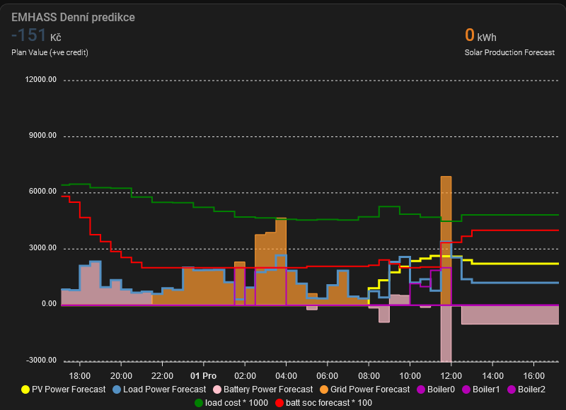
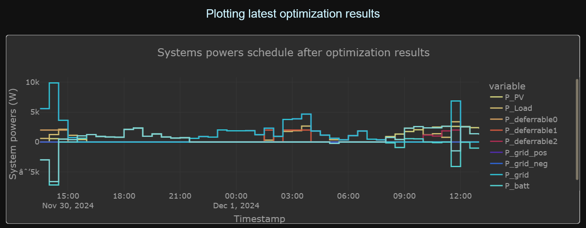
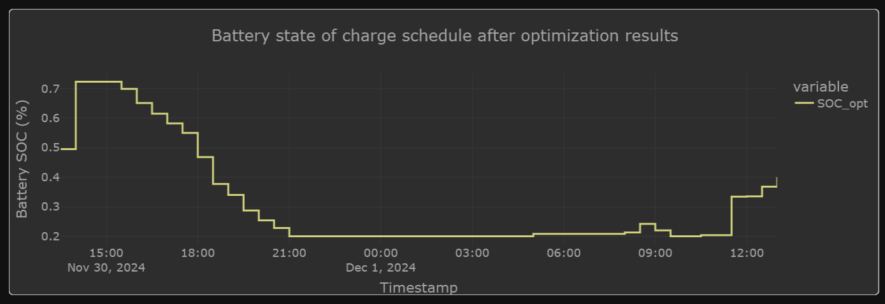
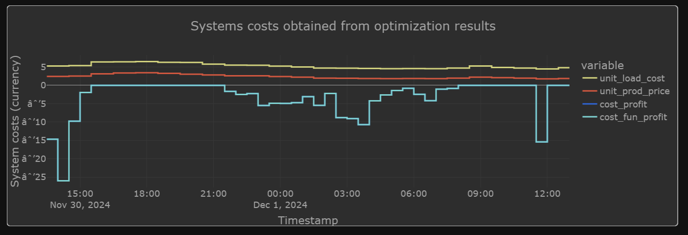
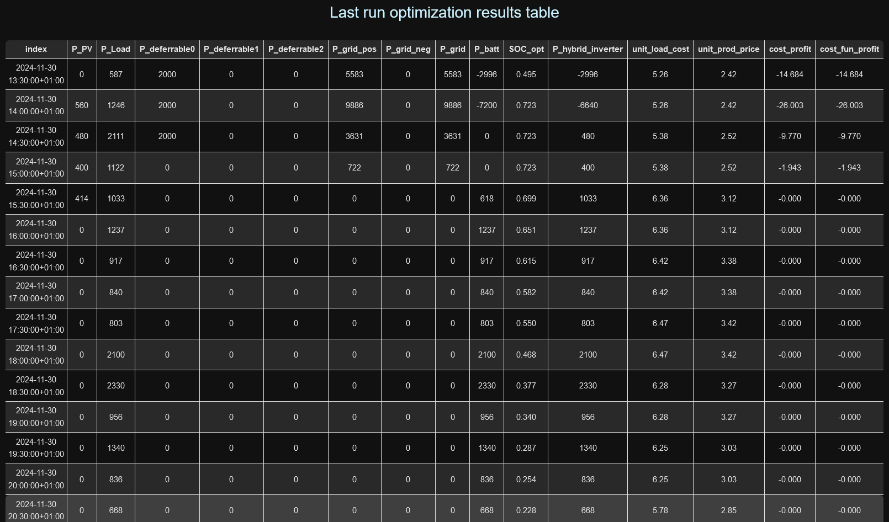
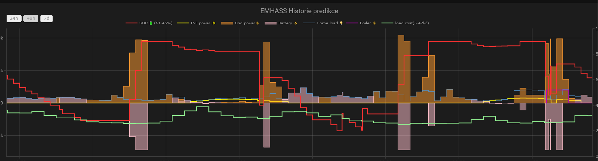
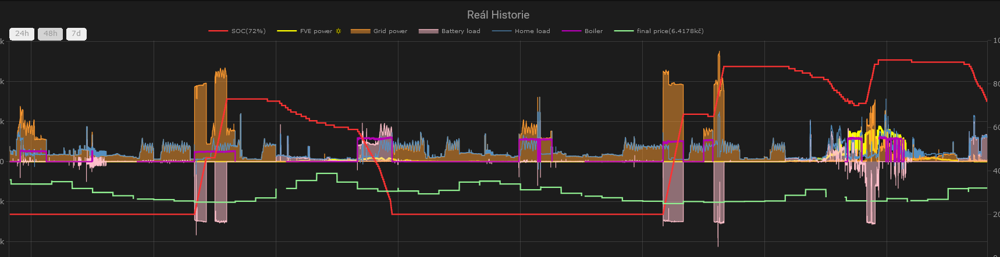
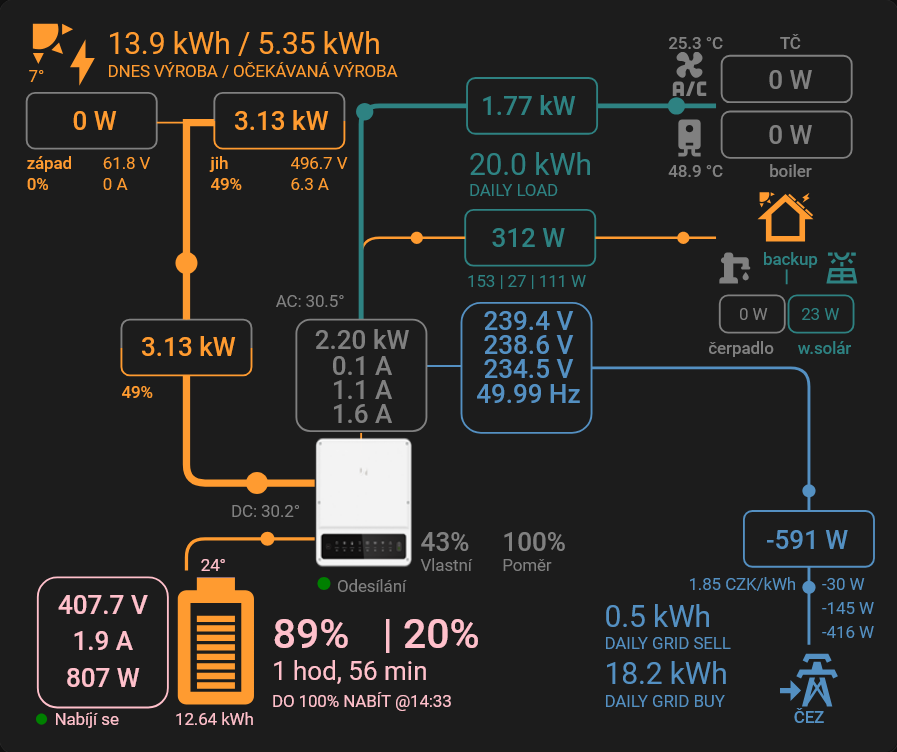

# EMHASS in Czech republic #
Zprovoznění EMHASS managmentu energie pro použití s českými spotovými cenami v Home assistantovi jako Add-onu. Jelikož je návod určen pro české prostředí, je použita čeština.

Uvedená konigurace je zprovozněna na měniči GoodWe 10K-ET s 6.4kWp panelů a 14.2kWh baterií Pylontech, ale půjde upravit i na jiný měnič. Pro výpočet je zvolena optimalizační metoda **dayahead** v kombinaci s **MPC**.

# Co je EMHASS? #
[EMHASS](https://emhass.readthedocs.io/en/latest/) - Energy managment system je predikční systém, který na základě vstupů (předpověď spotřeby domácnosti, předpověď výroby fotovoltaiky, stav nabití baterie, ceny energie na spotovém trhu, ...) dokáže řídit efektivní nabíjení / vybíjení baterie, ovládání spotřebičů s odložitelým spuštěním a nákup / prodej elektřiny.

Spuštění dayahead optimalizace je naplánováno na 14:03, kdy jsou známy nové spotové ceny na další den a během dne je pak spouštěna MPC, kdy se upresňuje aktuální energie v baterii. Boiler je použit jako odložitelná zátěž a jelikož ho nahřívám v noci, dopoledne a odpoledne, tak ho model zpracovává jako 3 samostatné odli6iteln0 zátěže (deferrable0, deferrable1 a deferrable2) s různými časovými okny a automatizace si e pospojuje do **deferrable012**. Systém umí nastavit své chování, jestli v optimalizaci jde o cenu, efektivní spotřebu energie nebo zisk podle vašeho přání.


# Instalace #
1. V doplňcích nainstalovat **EMHASS** (https://github.com/davidusb-geek/emhass-add-on) - je potřeba přidat repozitář a zvolit EMHASS jako add-on.
2. V HACS přidat **Nanogreen** pro zjišťování spotových cen.
3. V HACS přidat **Solcast PV Forecast** pro předpověď výroby solárního systému 'solcast'. Je třeba se zaregistrovat na stránky a dodat svoji elektrárnu (sklon, orientace, výkon, poloha). Do Home assistanta budeme pak potřebovat API-Key a Roof ID. Je dobré si pak předpovědi přidat do energy boardu, jsou hodně přesné.
4. V HACS přidat **GoodWe Inverter (experimental)** pro ovládání elektrárny. V případě jiného měniče je třeba upravit.
5. V zařízeních přidejte integraci **FILE** a přidejte službu zápisu oznámení do prvního souboru **/share/data_load_cost_forecast.csv** bez časového razítka a nastavte id_entity **notify.file_load_cost_csv**. Druhý soubor **/share/data_prod_price_forecast.csv** bez časového razítka a id_entity **notify.file_sell_cost_csv**. Tímto budeme EMHASSu předávat spotové ceny nákupu a prodeje.
6. Připojte se na filesystém Home assistanta a ve složce **/share** vytvořte soubor **zero.csv**, který obsahuje jednu mezeru.
7. Volitelně pro vizualizaci v HACS **apexchart-card**, **Plotly graph card**, **Sankey Chart Card** a **Sunsynk-Power-Flow-Card**.


# Konfikurace #
V **Doplňcích / EMHASS / Nastavení** nastavte dir /share, souřadnice long., lat. a alt, Solcast api-key + roof id a špičkový power elektrárny k kWp (s desetinnou čárkou)

Samotná konfigurace EMHASSu může vypadat následně (po přepnutí do textové formy):
```
{
  "battery_charge_efficiency": 0.9,
  "battery_charge_power_max": 6000,
  "battery_discharge_efficiency": 0.9,
  "battery_discharge_power_max": 8000,
  "battery_dynamic_max": 0.9,
  "battery_dynamic_min": -0.9,
  "battery_maximum_state_of_charge": 0.9,
  "battery_minimum_state_of_charge": 0.2,
  "battery_nominal_energy_capacity": 14200,
  "battery_target_state_of_charge": 0.5,
  "compute_curtailment": false,
  "continual_publish": false,
  "costfun": "profit",
  "delta_forecast_daily": 1,
  "end_timesteps_of_each_deferrable_load": [
    9,
    29,
    45
  ],
  "historic_days_to_retrieve": 10,
  "inverter_is_hybrid": true,
  "load_cost_forecast_method": "csv",
  "load_forecast_method": "naive",
  "load_negative": false,
  "load_offpeak_hours_cost": 0.1419,
  "load_peak_hour_periods": {
    "period_hp_1": [
      {
        "start": "02:54"
      },
      {
        "end": "15:24"
      }
    ],
    "period_hp_2": [
      {
        "start": "17:24"
      },
      {
        "end": "20:24"
      }
    ]
  },
  "load_peak_hours_cost": 0.1907,
  "logging_level": "INFO",
  "lp_solver": "default",
  "lp_solver_path": "empty",
  "maximum_power_from_grid": 12000,
  "maximum_power_to_grid": 6400,
  "method_ts_round": "first",
  "modules_per_string": [
    16
  ],
  "nominal_power_of_deferrable_loads": [
    2000,
    2000,
    2000
  ],
  "number_of_deferrable_loads": 3,
  "operating_hours_of_each_deferrable_load": [
    1.5,
    2,
    1.5
  ],
  "optimization_time_step": 30,
  "photovoltaic_production_sell_price": 1,
  "production_price_forecast_method": "csv",
  "pv_inverter_model": [
    "GoodWe_Technologies_Co___Ltd___GW9600H_ES__240V_"
  ],
  "pv_module_model": [
    "Trina_Solar_TSM_400DE09_08"
  ],
  "sensor_linear_interp": [
    "sensor.pv_power",
    "sensor.home_load_no_var_loads"
  ],
  "sensor_power_load_no_var_loads": "sensor.home_load_no_var_loads",
  "sensor_power_photovoltaics": "sensor.pv_power",
  "sensor_replace_zero": [
    "sensor.pv_power"
  ],
  "set_battery_dynamic": false,
  "set_deferrable_load_single_constant": [
    false,
    false,
    false
  ],
  "set_deferrable_startup_penalty": [
    0,
    0,
    0
  ],
  "set_nocharge_from_grid": false,
  "set_nodischarge_to_grid": false,
  "set_total_pv_sell": false,
  "set_use_battery": true,
  "set_zero_min": true,
  "start_timesteps_of_each_deferrable_load": [
    0,
    17,
    37
  ],
  "strings_per_inverter": [
    1
  ],
  "surface_azimuth": [
    180
  ],
  "surface_tilt": [
    25
  ],
  "treat_deferrable_load_as_semi_cont": [
    true,
    true,
    true
  ],
  "weather_forecast_method": "scrapper",
  "weight_battery_charge": 1.5,
  "weight_battery_discharge": 2
}
```
Jako Metoda předpovědi výroby FVE **Weather forecast method** je zvolena **solcast**, ale jsou zde na výběr i jiné: **scrapper**, **solar.foecast** a **csv**.
1. scrapper potřebuje mít v nastavení nadefinovánu zeměpisnou šířku, delku a v konfiguraci typ panelů a typ měniče
2. solcast potřebuje účet na webu solcast a z něj v nastavení nastaven api-key a roof%id; zdarma poskytuje 10 žádostí denně s rozlišením 30 minut
3. solar.forecast potřebuje v nastavení maximální výkon panelů; poskytje 12 žádostí za hodinu s rozlišením 1h

Do **config.yaml** přidat nastavení a senzory. Jsou zde přidány i senzory **import_power** a **export_power** pro správný výpočet spotřeb a utility meter pro nízký a vysoký tarif.
```
homeassistant:
  customize: !include customize.yaml
  allowlist_external_dirs:
    - /share
  
shell_command:
  restart_csv: cp /share/zero.csv /share/data_load_cost_forecast.csv; cp /share/zero.csv /share/data_prod_price_forecast.csv
  dayahead_optim: "curl -i -H \"Content-Type:application/json\" -X POST -d '{}' http://localhost:5000/action/dayahead-optim"
  naive_mpc_optim: "curl -i -H \"Content-Type:application/json\" -X POST -d '{\"prediction_horizon\":{{ state_attr('sensor.mpc_final','intervals') }},\"soc_init\":{{ (states('sensor.battery_state_of_charge')|float(20))/100 }},\"soc_final\":{{ state_attr('sensor.mpc_final','soc_final') }},\"operating_hours_of_each_deferrable_load\":{{ state_attr('sensor.mpc_final','def_len') }},\"start_timesteps_of_each_deferrable_load\":{{ state_attr('sensor.mpc_final','def_start') }},\"end_timesteps_of_each_deferrable_load\":{{ state_attr('sensor.mpc_final','def_end') }} }' http://localhost:5000/action/naive-mpc-optim"
  publish_data: "curl -i -H \"Content-Type:application/json\" -X POST -d '{}' http://localhost:5000/action/publish-data"

utility_meter:
  electric:
    source: sensor.import_kwh
    cycle: yearly
    tariffs:
      - vt
      - nt

sensor:
  - platform: template
    sensors:
      import_power:            # FVE
        unit_of_measurement: 'W'
        device_class: power
        unique_id: import_power_solar
        value_template: >-
          {{ ((states('sensor.active_power_l1') | float < 0) * states('sensor.active_power_l1') | float * -1) + ((states('sensor.active_power_l2') | float < 0) * states('sensor.active_power_l2') | float * -1) + ((states('sensor.active_power_l3') | float < 0) * states('sensor.active_power_l3') | float * -1)}}

      export_power:            # FVE
        unit_of_measurement: 'W'
        device_class: power
        unique_id: export_power_solar
        value_template: >-
          {{ ((states('sensor.active_power_l1') | float > 0) * states('sensor.active_power_l1') | float) + ((states('sensor.active_power_l2') | float > 0) * states('sensor.active_power_l2') | float) + ((states('sensor.active_power_l3') | float > 0) * states('sensor.active_power_l3') | float)}}

      final_buy_kwh:
        unit_of_measurement: 'CZK/kWh'
        device_class: monetary
        value_template: >-
          
            {{ (states('sensor.current_market_price_czk_kwh') | float(default=8.0)) * 1.21 + 2.22 }}
          
            {{ (states('sensor.current_market_price_czk_kwh') | float(default=8.0)) * 1.21 + 1.965 }}
          
        attribute_templates:
          hourly_prices: >-
            
            
            
              
                
              
                
              
              
            
            {{ ns.final }}

      final_sell_kwh:
        unit_of_measurement: 'CZK/kWh'
        device_class: monetary
        value_template: >-
          {{ (states('sensor.current_market_price_czk_kwh') | float(default=8.0)) - 0.3 }}
        attribute_templates:
          hourly_prices: >-
            
            
            
              
            
            {{ ns.final }}

      emhass_battery_control:
        unique_id: emhass_battery_control
        value_template: >-
            
            {{ 'charge' }}
          
            {{ 'discharge' }}
          
            {{ 'idle' }}
           
            {{ 'normal' }}                          
          

      p_deferrable012:
        unit_of_measurement: 'W'
        device_class: power
        value_template: >-
          {{ states('sensor.p_deferrable0') | float(default=0) + states('sensor.p_deferrable1') | float(default=0) + states('sensor.p_deferrable2') | float(default=0) }} 
        attribute_templates:
          schedule: >-
            
            
            
            
            
              
            
            {{ ns.final }}

# spotřeba domu bez odlozitelného spotřebiče (boileru)
      home_load_no_var_loads:
        unit_of_measurement: 'W'
        device_class: power
        value_template: "{{ states('sensor.load') | int + (states('sensor.back_up_load') | int) - (states('sensor.zasuvka_boiler_napajeni') | int) }}"

# volitelně pro boiler, aby spotřeba na fázi, kde je připojen nepekročila limit měniče a nedocucával ze sítě:
      prikon_bez_boileru:
        unit_of_measurement: 'W'
        device_class: power
        value_template: >-
          {{ states('sensor.load_l1') | float(default=0) + (states('sensor.back_up_l1_power') | float(default=0)) - (states('sensor.zasuvka_boiler_napajeni') | float(default=0)) }}

# data pro MPC
      mpc_final: # vypocte delku MPC parametru do value_teplate (min. delka 5 kvuli MPC)
        value_template: 22
        attribute_templates:
          soc_final: >-
            
              {{ 0.6 }}
            
              {{ 0.4 }}
            
              {{ 0.3 }}
            
          intervals: "{{ max(5,(states('sensor.mpc_final')|int + (now().hour >= states('sensor.mpc_final')|int)*24 - now().hour)*2 - (now().minute/30)|int) }}"
          def_len: >-
            
            
            
            
             
              
              
              
            
             
              
              
              
            
             
              
              
              
            
            {{ ns.out }}
          def_start: >-
            
            
            
            
              {% if (24 + time_end[i] - time_start[i] - 1) % 24 >= (24 + time_end[i] - now().hour - 1) % 24 %}
                  
              
                  {% set ns.out = ns.out + [((24 + time_start[i] - now().hour) % 24)*2 - (now().minute/30)|int] %}
              
            
            {{ ns.out }}
          def_end: >- 
            
            
            
              {% set ns.out = ns.out + [((24 + i - now().hour - 1) % 24)*2 + 2 - (now().minute/30)|int] %}
            
            {{ ns.out }}

  - platform: integration
    name: import_kWh
    source: sensor.import_power
    method: left
    unit_prefix: k

  - platform: integration
    name: export_kWh
    source: sensor.export_power
    method: left
    unit_prefix: k

binary_sensor:
  - platform: template
    sensors:
      deferrable012:
        value_template: "{{ states('sensor.p_deferrable0') | float(default=0) > 100 or states('sensor.p_deferrable1') | float(default=0) > 100 or states('sensor.p_deferrable2') | float(default=0) > 100}}" 

# pro moje řízení boileru, kdy do boileru podle teploty a nabiti baterie posilam prebytky pro nahrati na vyssi teplotu
  - platform: threshold
    name: kapacita_pro_boiler
    entity_id: sensor.prikon_bez_boileru
    lower: 1400
    hysteresis: 50
  - platform: threshold
    name: vlazny_boiler
    entity_id: sensor.teplota_boileru
    lower: 48
    hysteresis: 0.2
```
Součástí senzorů je i výpočet koncové ceny (final buy_kwh a energie final_sell_kwh) pro nákup a prodej. Je potřeba si ji upravit podle vašeho dodavatele / odběratele.

Senzor **home_load_no_val_loads** je spotřeba domu bez odložitelných zátěží - zde boileru.

Dejte restartovat HA pro načtení config.yaml

# Základní automatizace #
Generování **CSV** souborů a MPC optimalizace
```
alias: EMHASS dayahead optimalizace
description: ""
triggers:
  - at: "14:02:00"
    trigger: time
  - at: "22:02:00"
    trigger: time
actions:
  - action: shell_command.restart_csv
    data: {}
  - variables:
      prices: "{{ state_attr('sensor.final_buy_kwh', 'hourly_prices') }}"
      start_time: "{{ now().replace(minute=(now().minute >= 30) * 30, second=0) }}"
  - repeat:
      count: 48
      sequence:
        - data:
            message: >-
              {{ (as_datetime(start_time) + (repeat.index-1) *
              timedelta(minutes=30)).strftime('%Y-%m-%d %H:%M:%S') }}, {{
              prices[((now().hour * 2 + (now().minute >= 30) +
              repeat.index-1)/2) | int] | round(2) }}
          action: notify.send_message
          target:
            entity_id: notify.file_load_cost_csv
  - variables:
      prices: "{{ state_attr('sensor.final_sell_kwh', 'hourly_prices') }}"
      start_time: "{{ now().replace(minute=(now().minute >= 30) * 30, second=0) }}"
  - repeat:
      count: 48
      sequence:
        - data:
            message: >-
              {{ (as_datetime(start_time) + (repeat.index-1) *
              timedelta(minutes=30)).strftime('%Y-%m-%d %H:%M:%S') }}, {{
              prices[((now().hour * 2 + (now().minute >= 30) +
              repeat.index-1)/2) | int] | round(2) }}
          action: notify.send_message
          target:
            entity_id: notify.file_sell_cost_csv
  - action: shell_command.dayahead_optim
    data: {}
  - action: shell_command.publish_data
    data: {}
```

Generování **CSV** souborů a MPC optimalizace
```
alias: EMHASS MPC optimalizace
description: ""
triggers:
  - trigger: time
    at: "22:03:30"
  - trigger: time
    at: "23:03:30"
  - trigger: time
    at: "0:03:30"
  - trigger: time
    at: "1:03:30"
  - trigger: time
    at: "2:03:30"
  - trigger: time
    at: "3:03:30"
  - trigger: time
    at: "4:03:30"
  - trigger: time
    at: "5:03:30"
  - trigger: time
    at: "6:03:30"
  - trigger: time
    at: "7:03:30"
  - trigger: time
    at: "8:03:30"
  - trigger: time
    at: "9:03:30"
  - trigger: time
    at: "10:03:30"
  - trigger: time
    at: "11:03:30"
  - trigger: time
    at: "12:03:30"
  - trigger: time
    at: "13:03:30"
actions:
  - action: shell_command.restart_csv
    data: {}
  - variables:
      prices: "{{ state_attr('sensor.final_buy_kwh', 'hourly_prices') }}"
      start_time: "{{ now().replace(minute=(now().minute >= 30) * 30, second=0) }}"
  - repeat:
      count: "{{ state_attr('sensor.mpc_final','intervals') }}"
      sequence:
        - data:
            message: >-
              {{ (as_datetime(start_time) + (repeat.index-1) *
              timedelta(minutes=30)).strftime('%Y-%m-%d %H:%M:%S') }}, {{
              prices[((now().hour * 2 + (now().minute >= 30) +
              repeat.index-1)/2) | int] | round(2) }}
          action: notify.send_message
          target:
            entity_id: notify.file_load_cost_csv
  - variables:
      prices: "{{ state_attr('sensor.final_sell_kwh', 'hourly_prices') }}"
      start_time: "{{ now().replace(minute=(now().minute >= 30) * 30, second=0) }}"
  - repeat:
      count: "{{ state_attr('sensor.mpc_final','intervals') }}"
      sequence:
        - data:
            message: >-
              {{ (as_datetime(start_time) + (repeat.index-1) *
              timedelta(minutes=30)).strftime('%Y-%m-%d %H:%M:%S') }}, {{
              prices[((now().hour * 2 + (now().minute >= 30) +
              repeat.index-1)/2) | int] | round(2) }}
          action: notify.send_message
          target:
            entity_id: notify.file_sell_cost_csv
  - action: shell_command.naive_mpc_optim
    data: {}
  - action: shell_command.publish_data
    data: {}
```

Pravidelné publikování predikčních dat
```
alias: EMHASS publish
description: ""
trigger:
  - minutes: /5
    platform: time_pattern
    seconds: "0"
condition: []
action:
  - action: shell_command.publish_data
    data: {}
mode: single
```

Automatizace pro nízký - vysoký tarif elektřiny. Časy jsou natvrdo, jelikož pro FVE mám tarif PTV3 se stejnými časy po celý týden. Stav přepínače ovlivňuje cenu vpočtu spotové ceny (regulovaná část).
```
alias: tarif ČEZ PTV3
description: ""
mode: single
triggers:
  - minutes: "0"
    hours: "*"
    seconds: "2"
    trigger: time_pattern
conditions: []
actions:
  - if:
      - condition: or
        conditions:
          - condition: time
            after: "08:00:00"
            before: "09:00:00"
          - condition: time
            after: "12:00:00"
            before: "13:00:00"
          - condition: time
            after: "15:00:00"
            before: "16:00:00"
          - condition: time
            after: "19:00:00"
            before: "20:00:00"
    then:
      - target:
          entity_id: select.electric
        data:
          option: vt
        action: select.select_option
    else:
      - target:
          entity_id: select.electric
        data:
          option: nt
        action: select.select_option
```

# Testování beta provozu #
Nyní je systém připraven, ale zatím nemá vliv na elektrárnu a spotřebiče. Po prvním spuštění optimalizace a automatizaci (v odpoledních hodinách, aby systém znal ceny energie 24h dopředu a mohl vygenerovat aktuální cvs soubory s cenami) a publikování lze predikční data prohlížet v EMHASSu. Lze v něm také ručně spouštět optimalizace. Pozor na počty požadAvků na předpovědi, pro pokusy možná budete muset změnit **Weather forecast method**.





Se systémem si lze docela hrát, doporučuji si z příkladů zkopírovat / upravit grafy denní predikce, historie predikce a reálnou historii ( vyzadují apexchar a plotly graph) a sledovat chování systému.

Může být zajímavé v testovacím provozu porovnat hodotu nákladů klacické denní spotřeby a predikované **Total cost function value**.

# Akční automatizace #
Všechno pracuje a je načase i konat.

**Skripty zatím neobsahují podporu prodeje elktřiny a hlídání prodeje při záporných cenách.**
Automatizace na řízení baterie u GoodWe:
```
alias: EMHASS battery control
description: používání baterie dle EMHASS
triggers:
  - trigger: state
    entity_id:
      - sensor.emhass_battery_control
  - trigger: state
    entity_id:
      - sensor.battery_state_of_charge
  - trigger: state
    entity_id:
      - sensor.soc_batt_forecast
  - trigger: state
    entity_id:
      - sensor.final_sell_kwh
conditions: []
actions:
  - alias: kontrola charge nebo idle battery_control pro hloubku vybití
    if:
      - condition: or
        conditions:
          - condition: state
            entity_id: sensor.emhass_battery_control
            state: charge
          - condition: and
            conditions:
              - condition: state
                entity_id: sensor.emhass_battery_control
                state: idle
              - condition: numeric_state
                entity_id: sensor.battery_state_of_charge
                below: sensor.soc_batt_forecast
                enabled: false
    then:
      - alias: zakázání využívání baterie v charge a idle battery_control
        if:
          - alias: hloubka vybití baterie je pod 95%
            condition: numeric_state
            entity_id: number.goodwe_maximum_vybiti_v_siti
            above: 5
        then:
          - alias: vypnout používání baterie nastavením hloubky vybití na 95%
            action: number.set_value
            metadata: {}
            data:
              value: 5
            target:
              entity_id: number.goodwe_maximum_vybiti_v_siti
    else:
      - alias: povolení využívání baterie v normal a discharge battery_control
        if:
          - alias: hloubka vybití baterie je nad 20%
            condition: numeric_state
            entity_id: number.goodwe_maximum_vybiti_v_siti
            below: 80
        then:
          - alias: zapnout používání baterie nastavením hloubky vybití na 20%
            action: number.set_value
            metadata: {}
            data:
              value: 80
            target:
              entity_id: number.goodwe_maximum_vybiti_v_siti
  - alias: kontrola přetoků při záporných cenách
    if:
      - condition: numeric_state
        entity_id: number.final_sell_kwh
        below: 0.2
    then:
      - alias: zapni řízení dodávky do sítě
        if:
          - alias: řízení dodávky je vypnuto
            condition: state
            entity_id: switch.goodwe_rizeni_dodavky_do_site
            state: "off"
        then:
          - alias: zapnutí řízení dodávky do sítě
            entity_id: switch.goodwe_rizeni_dodavky_do_site
            action: homeassistant.turn_on
      - alias: zakaž přetoky do sítě
        if:
          - alias: limit dodávky neni 0
            condition: numeric_state
            entity_id: number.goodwe_limit_dodavky_do_site
            above: 0
        then:
          - alias: nastavi limit dodavky do site
            action: number.set_value
            metadata: {}
            data:
              value: 0
            target:
              entity_id: number.goodwe_limit_dodavky_do_site
    else:
      - alias: kontrola discharge battery_control
        if:
          - condition: state
            entity_id: sensor.emhass_battery_control
            state: discharge
        then:
          - alias: zapni řízení dodávky do sítě
            if:
              - alias: řízení dodávky je vypnuto
                condition: state
                entity_id: switch.goodwe_rizeni_dodavky_do_site
                state: "off"
            then:
              - alias: zapnutí řízení dodávky do sítě
                entity_id: switch.goodwe_rizeni_dodavky_do_site
                action: homeassistant.turn_on
          - alias: omez výkon do sítě na rezervovaný/povolený
            if:
              - alias: limit dodávky neni 6400W
                condition: template
                value_template: >-
                  {{ states('number.goodwe_limit_dodavky_do_site') | int(0) !=
                  6400 }}
            then:
              - alias: nastavi limit dodavky do site
                action: number.set_value
                metadata: {}
                data:
                  value: 6400
                target:
                  entity_id: number.goodwe_limit_dodavky_do_site
        else:
          - alias: >-
              nejsou záporné ceny ani vybíjenbí do sítě, vypni řízení (u GoodWe se sníží spotřeba na polovinu až třetinu); tuto část zrušit, pokud rezervovaný/povolený výkon do sítě je v+těí, než kWp výkon panelů
            if:
              - alias: řízení dodávky je zapnuto
                condition: state
                entity_id: switch.goodwe_rizeni_dodavky_do_site
                state: "on"
            then:
              - alias: vypnutí řízení dodávky do sítě
                entity_id: switch.goodwe_rizeni_dodavky_do_site
                action: homeassistant.turn_off
  - alias: kontrola charge battery_control pro dobíjení baterie
    if:
      - condition: state
        entity_id: sensor.emhass_battery_control
        state: charge
      - condition: numeric_state
        entity_id: sensor.battery_state_of_charge
        below: sensor.soc_batt_forecast
    then:
      - alias: zapnout nabijeni baterie
        if:
          - alias: měnič je v echo_charge módu
            condition: state
            entity_id: select.goodwe_provozni_rezim_stridace
            state: eco_charge
        then: []
        else:
          - alias: zapnout nabíjení baterie eco_charge režimem
            action: select.select_option
            metadata: {}
            data:
              option: eco_charge
            target:
              entity_id: select.goodwe_provozni_rezim_stridace
    else:
      - alias: kontrola discharge battery_control pro vybíjení baterie
        if:
          - condition: state
            entity_id: sensor.emhass_battery_control
            state: discharge
          - condition: numeric_state
            entity_id: sensor.battery_state_of_charge
            above: sensor.soc_batt_forecast
        then:
          - alias: zapnout vybíjení baterie eco_discharge režimem
            if:
              - alias: měnič je v eco_discharge módu
                condition: state
                entity_id: select.goodwe_provozni_rezim_stridace
                state: eco_discharge
            then: []
            else:
              - alias: měnič do eco_discharge režimu
                action: select.select_option
                metadata: {}
                data:
                  option: eco_discharge
                target:
                  entity_id: select.goodwe_provozni_rezim_stridace
        else:
          - alias: vypnout nabíjení/vybíjení baterie obecným režimem
            if:
              - alias: měnič je v obecném módu
                condition: state
                entity_id: select.goodwe_provozni_rezim_stridace
                state: general
            then: []
            else:
              - alias: měnič do obecného režimu
                action: select.select_option
                metadata: {}
                data:
                  option: general
                target:
                  entity_id: select.goodwe_provozni_rezim_stridace
mode: single
```

Automatizace pro ovládání boileru zásuvkou/shelly relátkem (zatím bez prodeje):
```
alias: EMHASS boiler
description: ohřev boileru podle EMHASS 3x denně
triggers:
  - trigger: state
    entity_id:
      - sensor.p_deferrable0
  - trigger: state
    entity_id:
      - sensor.p_deferrable1
  - trigger: state
    entity_id:
      - sensor.p_deferrable2
conditions: []
actions:
  - if:
      - condition: or
        conditions:
          - condition:
              - condition: numeric_state
                entity_id: sensor.p_deferrable0
                above: 100
              - condition: numeric_state
                entity_id: sensor.p_deferrable1
                above: 100
              - condition: numeric_state
                entity_id: sensor.p_deferrable2
                above: 100
    then:
      - entity_id: switch.zasuvka_boiler_vypinac
        action: homeassistant.turn_on
    else:
      - entity_id: switch.zasuvka_boiler_vypinac
        action: homeassistant.turn_off
mode: single
```

Příklad mojí automatizace pro ovládání boileru s teplotními čidly, kdy do boileru podle teploty a nabiti baterie posilam prebytky pro nahrati na vyssi teplotu:
```
alias: EMHASS Boiler s čidly teploty a FVE přebytky
description: inteligentní dohřívání boileru a počítání spotřeby boileru z FVE a ze sítě
triggers:
  - enabled: true
    seconds: "5"
    trigger: time_pattern
conditions: []
actions:
  - choose:
      - conditions:
          - condition: state
            entity_id: binary_sensor.deferrable012
            state: "off"
        sequence:
          - entity_id: switch.zasuvka_boiler_vypinac
            action: homeassistant.turn_off
      - conditions:
          - condition: or
            conditions:
              - condition: and
                conditions:
                  - condition: numeric_state
                    entity_id: sensor.teplota_boileru
                    below: 42
                  - condition: state
                    entity_id: binary_sensor.kapacita_pro_boiler
                    state: "on"
              - condition: and
                conditions:
                  - condition: state
                    entity_id: binary_sensor.vlazny_boiler
                    state: "on"
                  - condition: state
                    entity_id: binary_sensor.deferrable012
                    state: "on"
                  - condition: state
                    entity_id: binary_sensor.kapacita_pro_boiler
                    state: "on"
              - condition: and
                conditions:
                  - condition: state
                    entity_id: binary_sensor.kapacita_pro_boiler
                    state: "on"
                  - condition: numeric_state
                    entity_id: sensor.pv_power
                    above: 4000
                  - condition: numeric_state
                    entity_id: sensor.battery_state_of_charge
                    above: 75
              - condition: and
                conditions:
                  - condition: state
                    entity_id: binary_sensor.kapacita_pro_boiler
                    state: "on"
                  - condition: numeric_state
                    entity_id: sensor.pv_power
                    above: 2600
                  - condition: numeric_state
                    entity_id: sensor.battery_state_of_charge
                    above: 90
        sequence:
          - entity_id: switch.zasuvka_boiler_vypinac
            action: homeassistant.turn_on
    default:
      - entity_id: switch.zasuvka_boiler_vypinac
        action: homeassistant.turn_off
mode: single
```

# Příklady vizualizace #

```
square: false
type: grid
columns: 2
cards:
  - type: entities
    entities:
      - entity: sensor.p_deferrable012
      - entity: sensor.home_load_no_var_loads
      - entity: sensor.p_grid_forecast
      - entity: sensor.p_load_forecast
      - entity: sensor.p_pv_forecast
      - entity: sensor.p_batt_forecast
      - entity: sensor.soc_batt_forecast
      - entity: sensor.unit_load_cost
      - entity: sensor.unit_prod_price
      - entity: sensor.optim_status
    show_header_toggle: false
    state_color: true
  - type: custom:apexcharts-card
    span:
      start: minute
    header:
      show: true
      title: EMHASS Denní predikce
      show_states: true
      colorize_states: true
    now:
      show: false
      label: now
    yaxis:
      - id: power
        min: -1000
        max: 10000
        decimals: 2
        apex_config:
          forceNiceScale: true
          tick_amount: 4
    series:
      - entity: sensor.p_pv_forecast
        name: výkon FVE
        yaxis_id: power
        curve: stepline
        stroke_width: 3
        color: yellow
        show:
          in_header: false
          legend_value: false
        data_generator: |
          return entity.attributes.forecasts.map((entry) => {
            return [new Date(entry.date), entry.p_pv_forecast];
          });
      - entity: sensor.p_load_forecast
        name: příkon domu
        yaxis_id: power
        curve: stepline
        type: line
        color: rgb(84, 144, 194)
        show:
          in_header: false
          legend_value: false
        stroke_width: 3
        data_generator: |
          return entity.attributes.forecasts.map((entry) => {
            return [new Date(entry.date), entry.p_load_forecast];
          });
      - entity: sensor.p_batt_forecast
        name: výkon baterie
        yaxis_id: power
        curve: stepline
        color: pink
        show:
          in_header: false
          legend_value: false
        stroke_width: 1
        type: area
        data_generator: |
          return entity.attributes.battery_scheduled_power.map((entry) => {
            return [new Date(entry.date), entry.p_batt_forecast];
          });
      - entity: sensor.p_grid_forecast
        name: příkon ze sítě
        yaxis_id: power
        curve: stepline
        color: rgb(255, 155, 48)
        type: area
        show:
          in_header: false
          legend_value: false
        stroke_width: 1
        data_generator: |
          return entity.attributes.forecasts.map((entry) => {
            return [new Date(entry.date), entry.p_grid_forecast];
          });
      - entity: sensor.p_deferrable012
        yaxis_id: power
        curve: stepline
        name: Boiler
        color: rgb(180, 0, 180)
        show:
          in_header: false
          legend_value: false
        stroke_width: 2
        data_generator: |
          return entity.attributes.schedule.map((entry) => {
            return [new Date(entry.date), entry.p_deferrable012];
          });
      - entity: sensor.total_cost_fun_value
        unit: Kč
        name: Zisk/-Náklady dle denní predikce
        show:
          legend_value: false
          in_chart: false
      - entity: sensor.p_pv_forecast
        yaxis_id: power
        unit: kWh
        name: Výroba FVE dle denní predikce
        show:
          legend_value: false
          in_chart: false
      - entity: sensor.unit_load_cost
        name: nákup Kč/kWh * 1000
        yaxis_id: cost
        unit: Kč
        curve: stepline
        type: line
        color: green
        show:
          in_header: false
          legend_value: false
        stroke_width: 2
        data_generator: |
          return entity.attributes.unit_load_cost_forecasts.map((entry) => {
            return [new Date(entry.date), entry.unit_load_cost*1000];
          });
      - entity: sensor.soc_batt_forecast
        yaxis_id: soc
        unit: "%"
        name: SOC baterie * 100
        curve: stepline
        type: line
        color: red
        show:
          in_header: false
          legend_value: false
        stroke_width: 2
        data_generator: |
          return entity.attributes.battery_scheduled_soc.map((entry) => {
            return [new Date(entry.date), entry.soc_batt_forecast*100];
          });
    view_layout:
      position: main
title: EMHASS Predikce

```

```
type: custom:plotly-graph
title: EMHASS Historie predikce
view_layout:
  grid-area: sg
entities:
  - entity: sensor.soc_batt_forecast
    name: |
      $fn ({ ys,meta }) =>
        "SOC " + "(" +ys[ys.length - 1]+"%)"
    yaxis: y2
    line:
      color: rgb(255, 50, 50)
      width: 2
  - entity: sensor.p_pv_forecast
    yaxis: y1
    name: FVE power
    line:
      color: yellow
      width: 2
  - entity: sensor.p_grid_forecast
    yaxis: y1
    name: Grid power
    fill: tozeroy
    line:
      color: rgb(255, 155, 48)
  - entity: sensor.p_batt_forecast
    yaxis: y1
    curve: stepline
    fill: tozeroy
    name: Battery
    line:
      color: pink
    show:
      in_header: false
      legend_value: false
    stroke_width: 1
    type: area
  - entity: sensor.p_load_forecast
    yaxis: y1
    name: Home load
    line:
      color: rgb(84, 144, 194)
  - entity: sensor.p_deferrable012
    yaxis: y1
    curve: stepline
    name: Boiler
    line:
      color: rgb(180, 0, 180)
      width: 2
    show:
      in_header: false
      legend_value: false
  - entity: sensor.unit_load_cost
    name: |
      $fn ({ ys,meta }) =>
        "load cost" + "(" +ys[ys.length - 1]+"kč)"
    yaxis: y3
    line:
      color: lightgreen
      width: 2
hours_to_show: 48
refresh_interval: 600
defaults:
  yaxes:
    fixedrange: true
layout:
  legend:
    bgcolor: rgba(0,0,0,0)
    font:
      size: 9
    x: 0.2
  height: 410
  barmode: stack
  yaxis1:
    range:
      - -2000
      - 8500
  yaxis2:
    range:
      - 0
      - 100
    fixedrange: true
  yaxis3:
    range:
      - 0
      - 20
  xaxis:
    rangeselector:
      "y": 1.05
      buttons:
        - count: 24
          step: hour
        - count: 48
          step: hour
        - count: 7
          step: day
config:
  displayModeBar: false
  scrollZoom: false
```

```
type: custom:plotly-graph
title: Reál Historie
view_layout:
  grid-area: sg
entities:
  - entity: sensor.battery_state_of_charge
    name: |
      $fn ({ ys,meta }) =>
        "SOC" + "(" +ys[ys.length - 1]+"%)"
    yaxis: y2
    line:
      color: rgb(255, 50, 50)
      width: 2
  - entity: sensor.pv_power
    yaxis: y1
    name: FVE power
    line:
      color: yellow
      width: 2
  - entity: sensor.import_power
    yaxis: y1
    name: Grid power
    fill: tozeroy
    line:
      color: rgb(255, 155, 48)
  - entity: sensor.battery_load
    yaxis: y1
    curve: stepline
    fill: tozeroy
    name: Battery load
    line:
      color: pink
    show:
      in_header: false
      legend_value: false
    stroke_width: 1
    type: area
  - entity: sensor.home_load_no_var_loads
    yaxis: y1
    name: Home load
    line:
      color: rgb(84, 144, 194)
  - entity: sensor.boiler_power
    yaxis: y1
    curve: stepline
    line:
      color: rgb(180, 0, 180)
      width: 2
    name: Boiler
    show:
      in_header: false
      legend_value: false
  - entity: sensor.final_buy_kwh
    name: |
      $fn ({ ys,meta }) =>
        "final price" + "(" +ys[ys.length - 1]+"kč)"
    yaxis: y3
    line:
      color: lightgreen
      width: 2
hours_to_show: 48
refresh_interval: 600
defaults:
  yaxes:
    fixedrange: true
layout:
  legend:
    bgcolor: rgba(0,0,0,0)
    font:
      size: 9
    x: 0.2
  height: 410
  barmode: stack
  yaxis1:
    range:
      - -1500
      - 8500
  yaxis2:
    range:
      - 0
      - 100
    fixedrange: true
  yaxis3:
    range:
      - 0
      - 20
  xaxis:
    rangeselector:
      "y": 1
      buttons:
        - count: 24
          step: hour
        - count: 48
          step: hour
        - count: 7
          step: day
config:
  displayModeBar: false
  scrollZoom: false
```

```
type: custom:plotly-graph
view_layout:
  grid-area: sg
entities:
  - entity: sensor.final_buy_kwh
    name: |
      $fn ({ ys,meta }) =>
        "final price" + "(" +ys[ys.length - 1]+"kč)"
    yaxis: y1
    line:
      color: lightgreen
      width: 2
  - entity: sensor.final_sell_kwh
    name: |
      $fn ({ ys,meta }) =>
        "final price" + "(" +ys[ys.length - 1]+"kč)"
    yaxis: y1
    line:
      color: lightgreen
      width: 1
  - entity: sensor.pv_power
    name: |
      $fn ({ ys,meta }) =>
        "pv power"
    yaxis: y2
    line:
      color: rgba(255, 155, 48, 0.8)
      width: 2
  - entity: sensor.home_load
    name: |
      $fn ({ ys,meta }) =>
        "home power"
    yaxis: y2
    fill: tozeroy
    fillcolor: rgba(200, 162, 173, 0.5)
    line:
      color: rgb(200, 162, 173)
  - entity: sensor.import_power
    name: |
      $fn ({ ys,meta }) =>
        "import power"
    yaxis: y2
    fill: tozeroy
    fillcolor: rgba(74, 122, 122, 0.5)
    line:
      color: rgb(94, 160, 160)
      width: 1
  - entity: number.goodwe_maximum_vybiti_v_siti
    name: |
      $fn ({ ys,meta }) =>
        "DOD"
    yaxis: y3
    filters:
      - map_y: |
          { 
            return 100 - ys[i]; 
          }
    line:
      color: violet
      width: 1
  - entity: sensor.battery_state_of_charge
    name: |
      $fn ({ ys,meta }) =>
        "SOC"
    yaxis: y3
    line:
      color: rgb(255, 50, 50)
      width: 2
      shape: spline
hours_to_show: 48
title: null
refresh_interval: 600
defaults:
  yaxes:
    fixedrange: true
layout:
  legend:
    bgcolor: rgba(0,0,0,0)
    font:
      size: 9
    x: 0.2
  height: 410
  barmode: stack
  yaxis1:
    range:
      - 0
      - 15
    fixedrange: true
  yaxis2:
    range:
      - 0
      - 10000
  yaxis3:
    range:
      - 0
      - 120
  xaxis:
    rangeselector:
      "y": 1.05
      buttons:
        - count: 6
          step: hour
        - count: 24
          step: hour
        - count: 48
          step: hour
        - count: 7
          step: day
config:
  displayModeBar: false
  scrollZoom: false
```

```
square: false
type: grid
cards:
  - type: energy-date-selection
  - layout: horizontal
    height: 250
    unit_prefix: k
    round: 1
    convert_units_to: ""
    co2_intensity_entity: sensor.co2_signal_co2_intensity
    gas_co2_intensity: 2351.6459999999997
    min_box_size: 3
    min_box_distance: 5
    show_states: true
    show_units: true
    sections:
      - entities:
          - type: entity
            entity_id: sensor.water_solar_kwh
            name: vodní solár
            children: []
            color: yellow
          - type: entity
            entity_id: sensor.total_pv_generation
            name: FVE
            children:
              - sensor.total_battery_charge
              - sensor.export_wh
              - total
            color: var(--warning-color)
          - type: entity
            entity_id: sensor.total_battery_discharge
            name: vybíjení baterie
            children:
              - sensor.export_wh
              - total
            color: pink
          - type: entity
            entity_id: sensor.electric_nt
            name: distributor NT
            children:
              - sensor.battery_charge_yearly_grid
              - total
          - type: entity
            entity_id: sensor.electric_vt
            name: distributor VT
            children:
              - sensor.battery_charge_yearly_grid
              - total
      - entities:
          - type: entity
            entity_id: sensor.export_wh
            name: export
            children: []
            color: "#BE87E2"
          - type: entity
            entity_id: sensor.total_battery_charge
            name: nabíjení baterie FVE
            subtract_entities:
              - sensor.battery_charge_yearly_grid
            children: []
            color: "#5fb6ad"
          - type: entity
            entity_id: sensor.battery_charge_yearly_grid
            name: nabíjení baterie sítí
            children: []
            color: "#5fb6ad"
          - type: remaining_parent_state
            entity_id: total
            name: celková spotřeba
            children:
              - technicka
              - zahrada
              - koupelna
              - unknown
      - entities:
          - type: remaining_child_state
            entity_id: technicka
            name: technická
            children:
              - sensor.tc_kwh
              - sensor.boiler_yearly_sum
              - sensor.boiler_yearly_pv
              - sensor.zasuvka_solar_dodano_shrnuti
              - sensor.zasuvka_cerpadlo_dodano_shrnuti
              - sensor.kotel_kwh
          - type: remaining_child_state
            entity_id: koupelna
            name: koupelna
            children:
              - sensor.zasuvka_zebrik_dodano_shrnuti
          - type: remaining_child_state
            entity_id: zahrada
            name: zahrada
            children:
              - sensor.bazen_kwh
              - sensor.cov_kwh
          - type: remaining_parent_state
            entity_id: unknown
            name: ostatní
            children: []
        sort_group_by_parent: true
      - entities:
          - type: entity
            entity_id: sensor.tc_kwh
            name: TČ
            children: []
            color: red
          - type: entity
            entity_id: sensor.kotel_kwh
            name: kotel
            children: []
            color: red
          - type: entity
            entity_id: sensor.boiler_yearly_sum
            name: boiler ze sítě
            subtract_entities:
              - sensor.boiler_yearly_pv
            children: []
            color: orange
          - type: entity
            entity_id: sensor.boiler_yearly_pv
            name: boiler z FVE
            children: []
            color: orange
          - type: entity
            entity_id: sensor.zasuvka_cerpadlo_dodano_shrnuti
            name: čerpadlo užitkové vody
            children: []
          - type: entity
            entity_id: sensor.zasuvka_solar_dodano_shrnuti
            name: vodní solár
            children: []
            color: yellow
          - type: entity
            entity_id: sensor.zasuvka_zebrik_dodano_shrnuti
            name: topný žebřík
            children: []
          - type: entity
            entity_id: sensor.cov_kwh
            name: ČOV
            children: []
            color: brown
          - type: entity
            entity_id: sensor.bazen_kwh
            name: bazén
            children: []
        sort_group_by_parent: true
    energy_date_selection: true
    type: custom:sankey-chart
    show_names: true
    wide: true
    show_icons: false
    min_state: 0.1
    static_scale: 2
columns: 1
```

```
type: custom:sunsynk-power-flow-card
cardstyle: full
large_font: true
show_solar: true
panel_mode: true
inverter:
  model: goodwe_gridmode
  modern: false
  colour: grey
  autarky: energy
  three_phase: true
  auto_scale: true
battery:
  energy: 14200
  shutdown_soc: 20
  show_daily: false
  max_power: 6400
  full_capacity: 100
  auto_scale: true
  colour: pink
  animation_speed: 6
  dynamic_colour: true
  linear_gradient: false
  hide_soc: false
  show_remaining_energy: true
  show_absolute: true
  invert_power: false
solar:
  colour: rgb(255, 155, 48)
  animation_speed: 9
  show_daily: true
  mppts: 2
  max_power: 6400
  pv1_name: západ
  pv2_name: jih
  display_mode: 2
  auto_scale: true
  dynamic_colour: true
  pv2_max_power: 6400
  pv1_max_power: 3200
  pv3_max_power: 0
  pv4_max_power: 0
  efficiency: 3
load:
  show_daily: true
  show_aux: true
  additional_loads: 2
  animation_speed: 8
  load1_icon: mdi:water-pump
  load1_name: čerpadlo
  load2_icon: mdi:solar-power-variant-outline
  load2_name: w.solár
  aux_loads: 2
  aux_load1_icon: mdi:air-conditioner
  aux_load1_name: TČ
  aux_load2_icon: mdi:water-boiler
  aux_load2_name: boiler
  colour: "#2E8282"
  max_power: 6400
  dynamic_colour: true
  auto_scale: true
  show_daily_aux: false
  aux_name: load
  aux_type: mdi:home
  dynamic_icon: true
  essential_name: backup
  load3_icon: ""
  aux_dynamic_colour: true
grid:
  no_grid_colour: "#BE87E2"
  show_daily_buy: true
  show_daily_sell: true
  show_nonessential: false
  animation_speed: 8
  invert_grid: true
  max_power: 6400
  grid_name: ČEZ
  auto_scale: true
  show_absolute: false
entities:
  inverter_power_175: sensor.total_power
  inverter_voltage_154: sensor.l1_volts
  inverter_voltage_L2: sensor.l2_volts
  inverter_voltage_L3: sensor.l3_volts
  load_power_L1: sensor.back_up_l1_power
  load_power_L2: sensor.back_up_l2_power
  load_power_L3: sensor.back_up_l3_power
  load_frequency_192: sensor.meter_frequency
  inverter_current_164: sensor.l1_current
  inverter_current_L2: sensor.l2_current
  inverter_current_L3: sensor.l3_current
  day_battery_charge_70: sensor.today_battery_charge
  day_battery_discharge_71: sensor.today_battery_discharge
  battery_voltage_183: sensor.battery_voltage
  battery_soc_184: sensor.battery_state_of_charge
  battery_power_190: sensor.battery_power
  battery_current_191: sensor.battery_current
  battery_temp_182: sensor.battery_temperature
  day_grid_import_76: sensor.import_daily
  day_grid_export_77: sensor.export_daily
  grid_power_169: none
  grid_ct_power_172: sensor.active_power_l1
  grid_ct_power_L2: sensor.active_power_l2
  grid_ct_power_L3: sensor.active_power_l3
  day_load_energy_84: sensor.today_load
  day_pv_energy_108: sensor.today_s_pv_generation
  pv1_power_186: sensor.pv1_power
  pv1_voltage_109: sensor.pv1_voltage
  pv1_current_110: sensor.pv1_current
  pv2_power_187: sensor.pv2_power
  pv2_voltage_111: sensor.pv2_voltage
  pv2_current_112: sensor.pv2_current
  essential_power: sensor.back_up_load
  essential_load1: sensor.zasuvka_cerpadlo_napajeni
  essential_load2: sensor.zasuvka_solar_napajeni
  aux_power_166: sensor.load
  aux_load1: sensor.tc_power
  aux_load2: sensor.zasuvka_boiler_napajeni
  radiator_temp_91: sensor.inverter_temperature_radiator
  remaining_solar: sensor.solcast_pv_forecast_forecast_remaining_today
  grid_connected_status_194: sensor.grid_mode_code
  inverter_status_59: sensor.work_mode_code
  dc_transformer_temp_90: sensor.inverter_temperature_air
  battery_status: sensor.battery_mode_code
  aux_load2_extra: sensor.teplota_boileru
  environment_temp: sensor.atrea_venkovni_teplota
  pv_total: sensor.pv_power
  total_pv_generation: sensor.total_pv_generation
  aux_load1_extra: sensor.teplota_termostatu
  essential_load2_extra: sensor.teplota_akumulacni_nadoby
  energy_cost_buy: sensor.final_buy_kwh
  energy_cost_sell: sensor.final_sell_kwh
show_grid: true
show_battery: true
dynamic_line_width: true
max_line_width: 7
min_line_width: 1
view_layout:
  grid-area: flow
```
